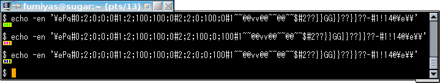

リンク
----------------------------------------------------------------------

資料

  * Sixel Graphics復活への動き - Togetterまとめ
    * <http://togetter.com/li/375434>
  * Sixel グラフィックス - VT100.net: VT330/VT340 プログラマーリファレンスマニュアル
    * <https://github.com/fumiyas/translation-ja/blob/master/vt3xx-sixel.md>
  * All About SIXELs
    * <ftp://ftp.cs.utk.edu/pub/shuford/terminal/all_about_sixels.txt>
  * Displaying Sixel Image Files
    * <http://rullf2.xs4all.nl/sg/doc.html>

ハウツーなど

  * OS X Mavericksにmltermとlibsixelをインストールして端末で画像を表示する - Keep It Simple, Stupid
    * <http://yskwkzhr.blogspot.jp/2014/04/use-mlterm-to-display-sixel-graphics-on-osx-mavericks.html>
  * Vimで画像を見る(DRCSのSIXEL拡張の話) - Qiita
    * <http://qiita.com/kefir_/items/78e64c545a70a0ebea8a>
  * Presentation on your terminal
    * <http://www.slideshare.net/syuu1228/presentation-on-your-terminal>

対応端末
----------------------------------------------------------------------

  * xterm - Terminal emulator for the X Window System
    * <http://invisible-island.net/xterm/>
  * mlterm - multilingual terminal emulator on X11
    * <http://mlterm.sourceforge.net/>
    * X、Windows、フレームバッファー用
  * RLogin
    * <http://nanno.dip.jp/softlib/man/rlogin/>
    * Windows用
  * yaft - yet another framebuffer terminal
    * <http://uobikiemukot.github.io/yaft/>
    * <https://github.com/uobikiemukot/yaft>
  * Tanasinn - 三 ┏( ^o^)┛ ＜ Terminal emulator extension for Firefox / Thunderbird / SeaMonkey
    * <http://saitoha.github.io/tanasinn/>
    * <https://github.com/saitoha/tanasinn>
    * <http://zuse.jp/tanasinn/usermanual-ja.html>
  * etc.

対応ソフトウェア
----------------------------------------------------------------------

### ライブラリ、モジュール

  * libsixel - A lightweight, fast implementation of DEC SIXEL graphics codec
    * <http://saitoha.github.io/libsixel/>
    * <https://github.com/saitoha/libsixel>
    * README には関連/対応ソフトウェアの紹介も多数掲載
  * PySixel - View full-pixel color graphics on SIXEL-supported terminals
    * <https://github.com/saitoha/PySixel>

### ユーティリティなど

  * sdump - sixel image dumper
    * <https://github.com/uobikiemukot/sdump>
  * Sixel版 Tw - Twitter client on Ruby
    * <https://bitbucket.org/arakiken/tw/commits/branch/sixel>
  * Sixel版 mikutterm - 端末でmikutterを使えるプラグイン
    * <https://bitbucket.org/arakiken/mikutterm/branch/sixel>
  * qrc - QR code generator for text terminals (ASCII art, Sixel)
    * <https://github.com/fumiyas/qrc>
  * sixelslide - freestanding slideviewer using sixel graphics
    * <https://github.com/syuu1228/sixelslide>
  * Ghostscript
    * <http://www.ghostscript.com/>
    * Sixel 対応プリンターである LN03 / LN50 / LA75 用のドライバー `ln03` を利用
  * gnuplot
    * <http://www.gnuplot.info/>
    * <http://sourceforge.net/p/gnuplot/patches/647/>
  * Netpbm
    * <http://netpbm.sourceforge.net/>
    * `ppmtosixel`(1) コマンド
  * kmiya's sixel
    * <http://nanno.dip.jp/softlib/man/rlogin/sixel.tar.gz>
    * <https://github.com/saitoha/sixel>

### パッケージ

  * Homebrew tap
    * <https://github.com/aki017/homebrew-sixel>
    * Sixel 関連のソフトウェアを多数収録
    * Mac OS X 用

シェルで Sixel してみる
----------------------------------------------------------------------

bash, zsh を前提とします。

### 端末が Sixel 対応しているかどうかを調べる

端末に DA1 (Primary Device Attributes) を問い合わせ、
Sixel 対応を示す属性値 `4` が含まれていることを確認します。

mlterm 3.3.8 上での実行例:

```console
$ stty -echo; echo -en '\e[c'; read -d c da1 <&1; stty echo; echo -E "${da1#*\?}"
1;2;4;7
```

  1. DA1 の問い合わせ
    * 「ESC + `[c`」を端末に出力する。
    * 上記例では応答が画面にエコーバックされないように
      `stty -echo` で抑制している。
  2. DA1 の取得
    * 端末から属性値を入力する。
    * 「ESC + `[?` + 属性値 [+ `;` + 属性値 ...] + `c`」という形式。

参考:

  * DA1 - Primary Device Attributes - VT100.net VT510 Video Terminal Programmer Information
    * <http://www.vt100.net/docs/vt510-rm/DA1>

### Sixel 文字列を出力して画像を描画する

```console
$ echo -en '\ePq#0;2;0;0;0#1;2;100;100;0#2;2;0;100;0#1~~@@vv@@~~@@~~$#2??}}GG}}??}}??-#1!14@\e\\'
```

  1. Sixel 文字列の開始
    * 「ESC + `Pq`」を端末に出力する。
  2. 色番号に色を割り当てる
    * 「`#` + 色番号 + `;2;` + 赤明度 + `;` + 緑明度 + `;` + 青明度」を端末に出力する。
    * 色番号は 0 〜 255 の範囲を指定する。
    * `;2;` 部分は色を RGB (赤、緑、青) で指定することを示す。
    * 各色の明度は `0` 〜 `100` の値 (%) を指定する。
  3. ビットマップデータ (Sixel) の描画色の指定
    * 「`#` + 色番号」を端末に出力する。
    * 項番 2 で割り当てた色番号を指定する。
  4. ビットマップデータ (Sixel) の出力
    * 「`?`」から「`~`」の範囲の ASCII 文字 (ASCII コード 0x3F 〜 0x7E) を端末に出力する。
    * 文字の ASCII コードから 0x3F 引いた値の
      6 ビットが縦 6ピクセル分のビットマップデータとして描画される。
    * 最下位ビットが一番上のピクセルになる。
  5. ビットマップデータ (Sixel) の繰り返し描画
    * 「`!` + 繰り返し回数」を端末に出力する。
    * 続くビットマップデータ文字 (項番 4) が指定した回数繰り返し描画される。
  6. 描画位置の復帰
    * 「`$`」を端末に出力する。
    * 描画位置が現在の行の左端に移動する。
  7. 描画位置の改行
    * 「`-`」を端末に出力する。
    * 描画位置が次の行の左端に移動する。
  8. 項番 3 〜 7 を繰り返す。
  9. Sixel 文字列の終了
    * 「ESC + `\`」を端末に出力する。

mlterm 上での Sixel 描画例:


